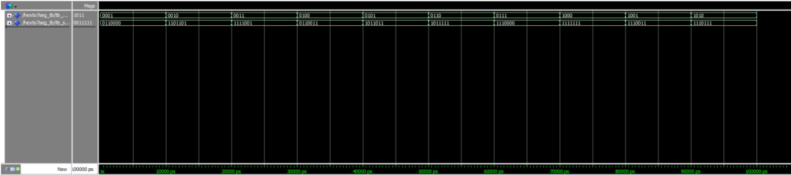

# Hexadecimal to 7-Segment Display Decoder (VHDL RTL)

## 📌 Project Description
This project implements a 4-bit Hexadecimal to 7-Segment Display Decoder using VHDL at RTL level for a common cathode display configuration.

The design converts a 4-bit hexadecimal input into the corresponding 7-segment output signals based on a predefined truth table.

---

## ⚙️ Design Specifications

- Language: VHDL
- Design Level: RTL (Register Transfer Level)
- Input: 4-bit hexadecimal (hex_in[3:0])
- Output: 7-bit segment control (seg_out[6:0])
- Display Type: Common Cathode
- Verification Method: Functional Simulation using Testbench

---

## 🧠 Implementation Approach

Two different design methodologies are used:

### 1️⃣ Behavioral Design
- Implemented using `case-when` structure
- Based directly on truth table mapping

### 2️⃣ Structural / Logic-Based Design
- Implemented using Boolean logic expressions
- Represents hardware-level combinational logic

---

## 🧪 Verification

A dedicated VHDL testbench is created to verify the functionality of the decoder for all hexadecimal input combinations (0–F).

Simulation results confirm that the decoder produces correct segment outputs for each input.

---

## 📁 Project Files

| File | Description |
|------|-------------|
| HexTo7Seg.vhd | RTL implementation |
| HexTo7Seg_TB.vhd | Testbench for functional verification |

---

## 🎯 Learning Outcomes

- Truth table to RTL mapping
- Combinational logic design using VHDL
- Behavioral vs Structural hardware modeling
- Functional verification with testbench

---

## 📊 Simulation Result

Functional verification of the design is performed using a VHDL testbench.

